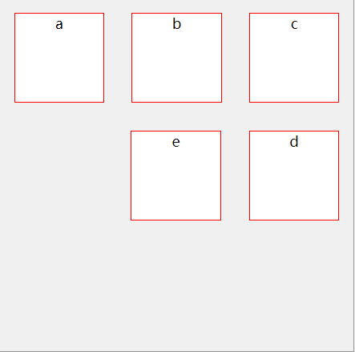

# flex
*面试题:实现下图的效果*

: 

## 解决思路
>     * float+边距(想想就无比麻烦，没有去写)
>     * flex
### 浅谈flex   
  flex的教程无比多，当然也有不少人看过阮一峰的教程。但是在阮一峰教程中，并没有这种类似的排列。  
  该面试题中只需要用到父容器的flex设置，所以只贴出父的属性设置。  
父：
>     display:flex | inline-flex;
>     flex-direction:row | row-reverse | column | column-reverse; [主轴的排列方向]
>     flex-wrap：nowrap | wrap | wrap-reverse;
>     flex-flow:<flex-direction> || <flex-wrap>; 
>     justifu-content:flex-start | flex-end | center | space-between[两端贴边界,中间剩余空间等距离平分] | space-around[中间边距是两端的两倍];[主轴对齐方式] 
>     alihn-items:stretch[项目未设置高度或设为auto,将占满整个容器] | flex-start | flex-end | center | baseline [第一行文字基线对齐]; [交叉轴对齐方式，类似于justify-content]
>     align-content [多个轴线对齐方式,一根无效]      

##### 实现：
html：

    

        

            a
            b
            c
        

        

            d
            e
            
        

        

   
    

css：

    #box{
        width: 400px;
        height: 400px;
        border: 1px solid #999;
        margin: 0 auto;
        display: flex;
        flex-direction: column;
        justify-content: space-around;

        
    }
    #top, #center{display: flex;justify-content: space-around;}
    #center{
        flex-direction: row-reverse;

    }
    .item{
        width: 100px;
        height: 100px;
        background: #fff;
        border: 1px solid #f00;
    }
    /*占位的span。宽度和item一样*/
    #center > span:nth-child(3){
        width:100px
    }
    /* 占位的buttom。高度和item一样 */
    #buttom{
        display:flex;height:100px;
    }
#### 总结
添加了空标签，利用其占位乃下下策，但暂时想不到更好的方法。后期想到更好的方法后再来修改。  
如果不用空标签占位，需要设置边距。但在后面的修改样式上要改的地方较多所以pass。