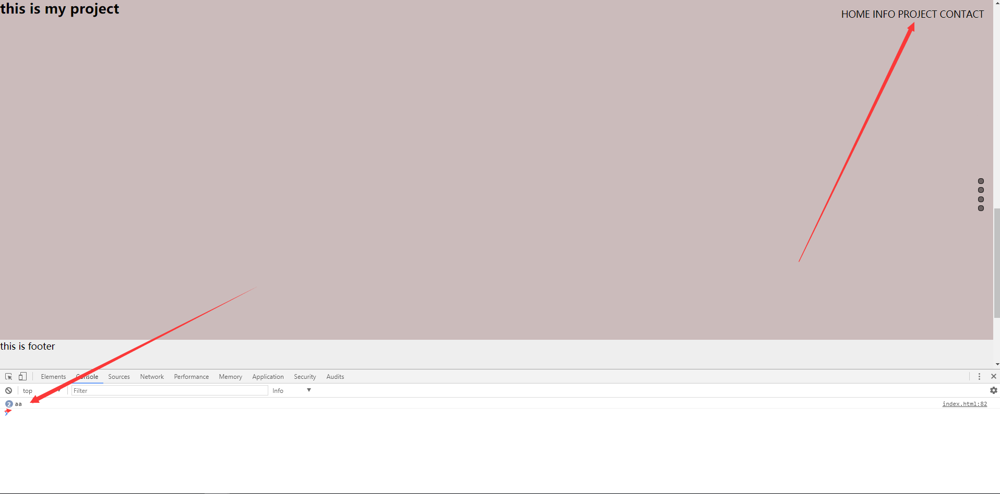

### animate 两次调用的问题

*先放代码*  
html:
``` html
<div id = "nav">
    <span linkTo="#header" class="links">HOME</span>
    <span linkTo="#info"  class="links">INFO</span>
    <span linkTo="#projects"  class="links">PROJECT</span>
    <span linkTo="#footer"  class="links">CONTACT</span>
</div>  
```  
jquery:
``` javascript
$('.links').on('click', function(){
    let links = $(this).attr('linkTo');
    // google body ; firfox html
    $("html, body").animate({scrollTop:$(links).offset().top}, 1000, function(){
        console.log('aa');
    });
});
```  
效果：

点击PROJECT后，console出来了两遍aa。   
#### 分析原因  
分别测试了这两种浏览器。  
**chrome举例：**
``` JavaScript  
// 依然会console 出 aa。但是无法执行animate的动画效果。所以也就能解释为什么开始会console两遍aa
$("html").animate({scrollTop:$(links).offset().top}, 1000, function(){
        console.log('aa');
    });
```  
这是自己为了偷懒方便兼容firfox和chrome而导致的小bug。
google body ; firfox html   
