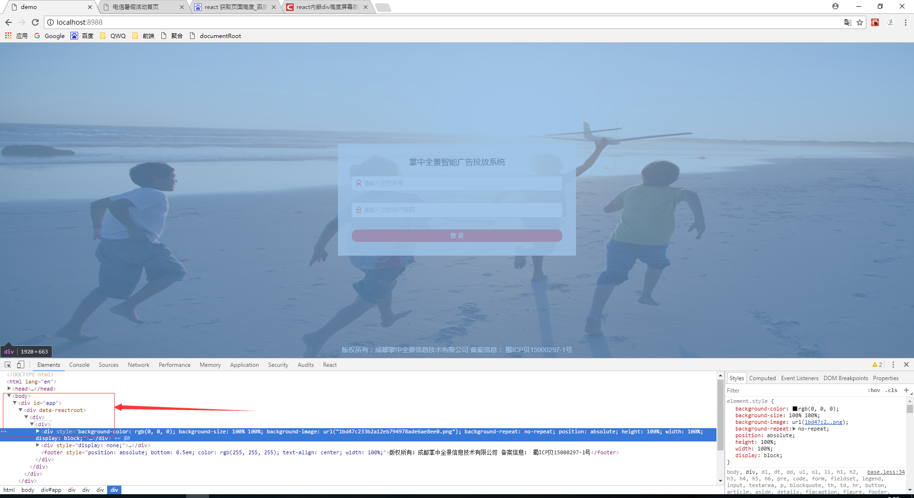

### 布局小插曲

#### 嵌套多层div屏幕大小自适应
  
* 背景图片所在的div嵌套太多层，于是设置100%是没多大可行性的
* 于是第二种方法 动态获取高度
```javascript  

     height: `${document.body.clientHeight }`  
```   
这种方发有个弊端就是每次都只有刷新或者打开时背景才会自适应，如果缩放浏览器就会出现滚动条。所以放弃了。    

* 通过定位完美解决  
``` css 
        position: "absolute",
        height: "100%",
        width: "100%",
```  
现在就能够随意缩放屏幕依然自适应了！