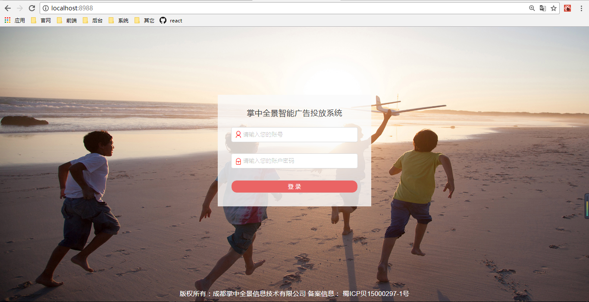
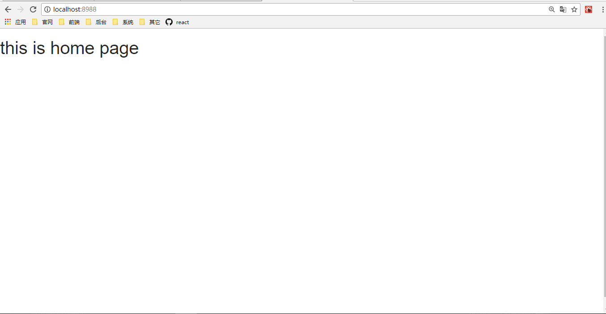

### react 登录跳转
>刚到公司两周，从零开始接触了react，并在react写的旧项目，上面稍微改了一些bug。
新项目的框架选型也是react，然后花了几天了解了各种包库啊redux什么的，并做了一个大概的构建。响应的第一个跳转就是登录跳转，还好公司新项目没有注册和记住密码这些需求。  

**说明**  
我用的是同一页面替换dom的方式实现的。总觉得不是很合适，应该用route匹配什么的完成。但是由于我这个登录页面比较简单，所以也还能将就。具体改进以后把route这块搞清楚了在搞。  
**过程**  
>* 登录信息过滤啊初步检验什么的  
>* Login组件里面dispatch函数到action中，ajax请求后台验证用户。  
>* reducer中更改isLogin:true。放到全局store中。
>* 页面中在判断isLogin然后就display:none|block响应的登录组件和主页的组件。  

*但是这里会出现一个问题，主页如果刷新页面会由跳转到登录页面。于是加了个本地缓存，暂时没想到更好的办法*    
```javascript
     if (isLogin) {sessionStorage.setItem("users", "true") }  
    display: `${ sessionStorage.getItem("users") ? 'none' : 'block' }` // 这是登录组件stylez中的判断
```
就这样很笨的方法实现了登录跳转，但是肯定需要用更好的办法。
*[相关页面地址并没有跳转，也可以看出是一个页面]*




